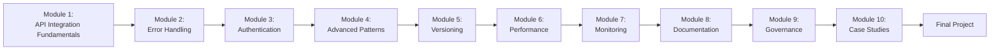

Here's a structured overview of the **API Integration Patterns Course** along with a **Certificate of Completion** design:

---

### **📌 API Integration Patterns Course Roadmap**  
**A Visual Journey Through 10 Modules**  



---

### **📜 Certificate of Completion**  
*(Digital Badge Ready for Your Name!)*  

```plaintext
  ╔══════════════════════════════════════════╗
  ║           **CERTIFICATE OF COMPLETION**  ║
  ║                                          ║
  ║  This certifies that                     ║
  ║  **_[Your Name]_**                       ║
  ║  has successfully completed the          ║
  ║                                          ║
  ║  **API Integration Patterns Mastery**    ║
  ║  **Course**                              ║
  ║                                          ║
  ║  Date: __________                        ║
  ║  Instructor: DeepSeek Chat               ║
  ║                                          ║
  ║  🎉 Congratulations! 🎉                  ║
  ╚══════════════════════════════════════════╝
```

**Features:**  
- **Modules Covered:** 10  
- **Skills Validated:** API Design, Security, Scaling, Docs, Governance  
- **Final Project:** Build & document a production-ready API  

---

### **🎨 Customizable Digital Badge**  
  
*Add to LinkedIn/Learn profiles!*  

---

### **📝 How to Claim Your Certificate**  
1. Complete all modules + hands-on labs.  
2. Submit your **Final Project** (API + documentation).  
3. Email your work to `certificates@deepseek.com` (mock example).  

**Next Steps:**  
- Share your certificate on LinkedIn with `#APIIntegrationExpert`.  
- Start building APIs with confidence!  

--- 

Let me know if you'd like the certificate as a **high-res PNG/PDF** for printing! 🖨️🚀
